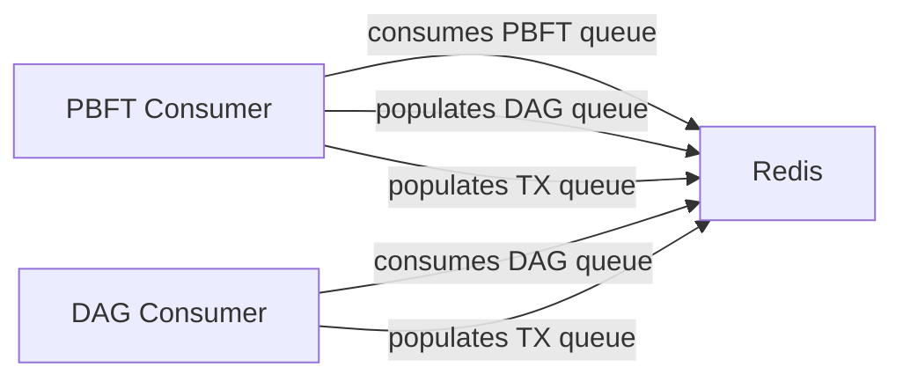
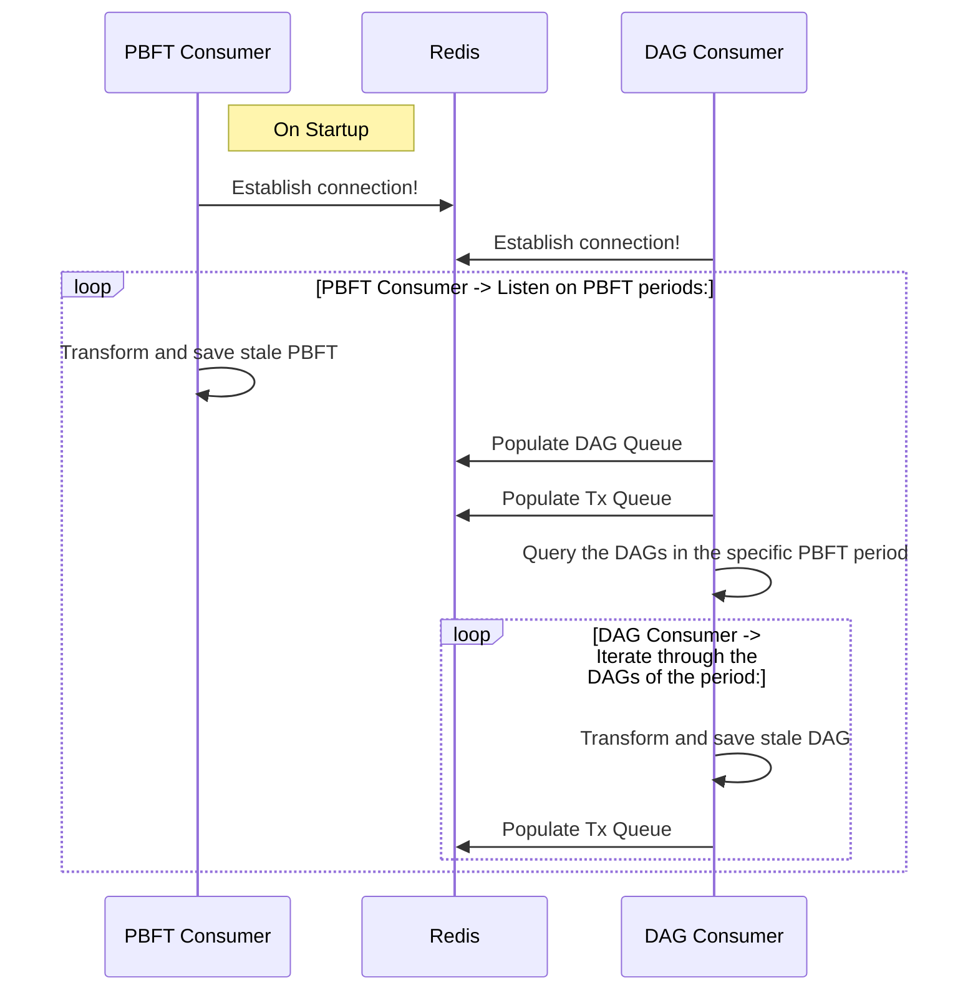

# Block Consumer documentation

To successfully run the indexer in the block consumer mode you need to make sure the following env vars are set besides the default config:

- `ENABLE_PRODUCER_MODULE=false`
- `ENABLE_TRANSACTION_CONSUMER=false`

## Switching nets

To Switch the indexer's target network you need to change:

- `APP_PREFIX=<you-preferred-prefix>(ex. testnet)`
- `NODE_WS_ENDPOINT=<you-preferred-rpc-endpoint>(ex. wss://ws.testnet.taraxa.io)`
- `NODE_GRAPHQL_ENDPOINT=<your-preferred-graphql-endpoint>(ex. https://graphql.testnet.taraxa.io/)`

### Modules

Two active modules are tasked to consume blocks: the dag and the pbft modules. Both of them hook directly into the queueing mechanism via the classes: [PbftConsumer](../src/modules/pbft/pbft.consumer.ts) and [DagConsumer](../src/modules/dag/dag.consumer.ts).

### Processes

#### PBFT Processing

Processing a PBFT consists of the next steps:

- Take a Job off the PBFT queue.
- Query the consisting PBFT data from GraphQL.
- Save the block data into Postgres.
- Populate the DAG queue with the done PBFT's period.
- Populate the TX queue with the hashes of the PBFT's transactions.

#### DAG Processing

Processing a DA consists of the next steps:

- Take a Job off the DAG queue.
- Query all the DAGs of the job's PBFT period.
- Loop through the DAGs and persist the stale DAG block data.
- Populate the queue with the transaction hashes.

#### Sequence diagram

