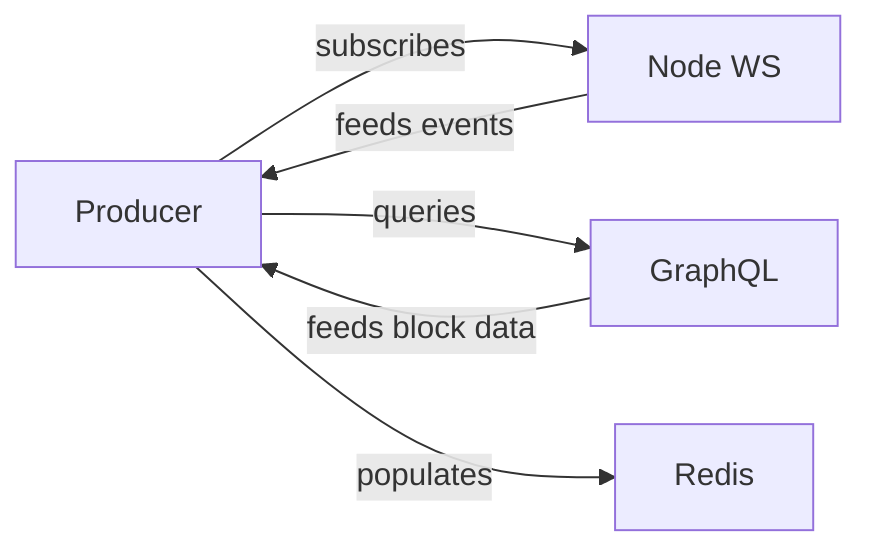
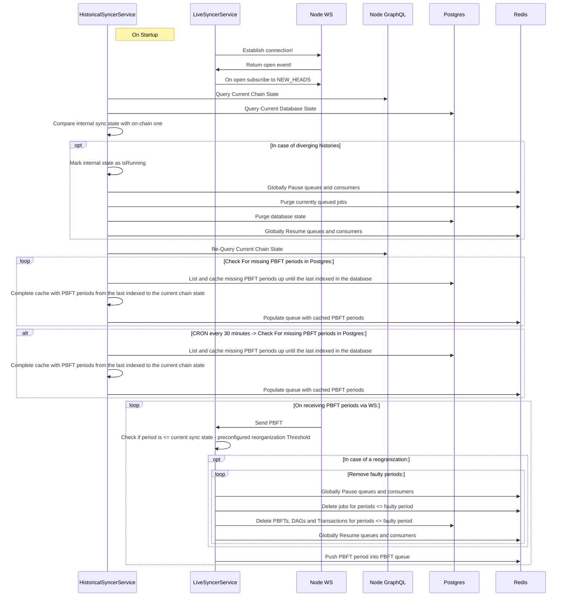

# Producer documentation

To successfully run the producer you need to make sure the following env vars are set besides the default config:

- `ENABLE_PRODUCER_MODULE=true`
- `ENABLE_TRANSACTION_CONSUMER=false`

## Switching nets

To Switch the indexer's target network you need to change:

- `APP_PREFIX=<you-preferred-prefix>(ex. testnet)`
- `NODE_WS_ENDPOINT=<you-preferred-rpc-endpoint>(ex. wss://ws.testnet.taraxa.io)`
- `NODE_GRAPHQL_ENDPOINT=<your-preferred-graphql-endpoint>(ex. https://graphql.testnet.taraxa.io/)`

### Processes

On all levels, the producer needs 3 connections to work:

- A Node WS endpoint that exposes a subscription method to the network's `NEW_HEADS` event.
- A GraphQL endpoint that supports the `[Ethereum GraphQL interface](https://eips.ethereum.org/EIPS/eip-1767)`.
- A working Redis or other queueing solution connection(called Redis afterwards).

On a modular level the producer consists of two main actors: the `LiveSyncer` and the `HistoricalSyncer` modules. As their name states, both are tasked to keep the block queues populated with PBFT periods.

#### Data Ingestion

To ingest a network's progress a direct connection to a Taraxa node's WS endpoint is estabished. This, in turn, creates an automatically renewing subscription to the Taraxa network's `NEW_HEADS` event containing `the newest included and mined PBFT block`. However, this guarantees us access only to future blocks. We also need to take care of indexing the past state of the network.

#### Sequence diagram

