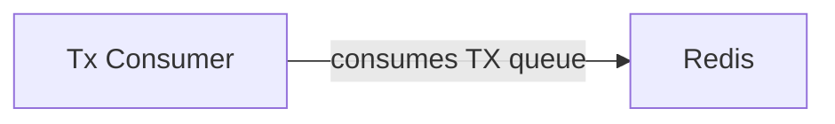
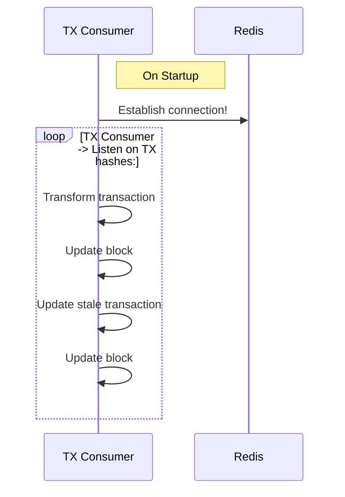

# Transaction Consumer documentation

To successfully run the indexer in the transaction consumer mode you need to make sure the following env vars are set besides the default config:

- `ENABLE_PRODUCER_MODULE=false`
- `ENABLE_TRANSACTION_CONSUMER=true`

## Modules

One active modules are tasked to consume transactions: the transaction module, more specifically the TransactionConsumer class: [TransactionConsumer](../src/modules/transaction/transaction.consumer.ts).

### Processes

#### Transaction Processing

Processing a transaction consists of the next steps:

- Take a Job off the Transactions queue.
- Query the consisting Transaction data from GraphQL.
- Update the already registered stale transaction from Postgres.

#### Sequence diagram

